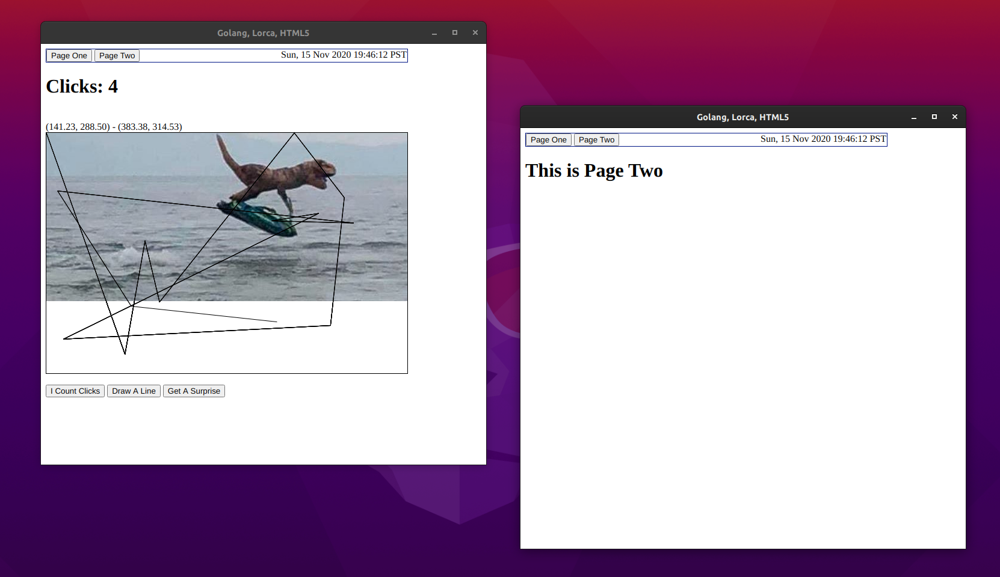

# An Example of Go Application with a GUI Using lorca 

I have looked all over the Googlesphere for a good example of a Go application 
that uses `github.com/zserge/lorca`.  Especially an application that leverages 
HTML5's `canvas` object.

This example creates an application that illustrates:  

* HTML 5 `canvas` drawing  
* Buttons and `lorca`'s function binding  
* Golang event loop using `select` over multiple channels
* Pushing content (the current time) from server-side asynchronous events.

## To Build ##  

1. Make sure you have Chrome installed.  You _do_ have Chrome (or Chromium or Microsoft's Chrome variant), right?
1. Download the repository
1. run `$ go build ./...`
1. run `$ ./lorca_example`

_Using HTML5 CSS, you can create multiple pages and toggle between them._

One aspect of this solution that I am not fully a fan of is the amount of raw HTML and Javascript that is required to implement a basic application.  While embracing separation of concerns and MVC models are excellent objectives, it would be ideal to be able to be able to write an application in pure Go, and let Go libraries provide interfaces to HTML and Javascript through idiomatic Golang.

